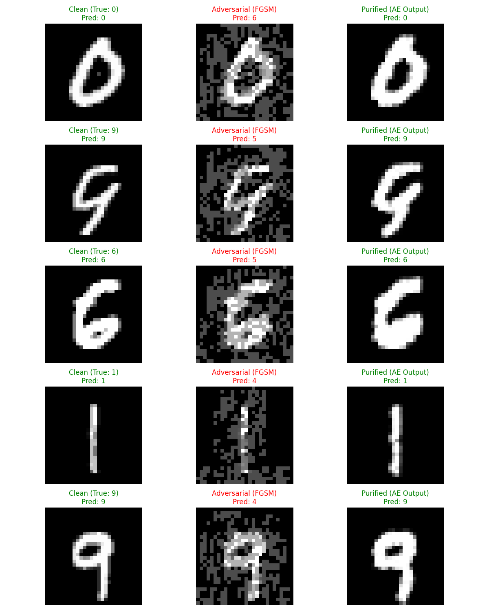

# 🛡️ LUGAI: Latent Uncertainty Guided Adversary Intervention

**Project Group No: 30**
**Scholars: Jayal Shah, Sakshi Makwana, Mayank Jangid**

This repository contains the code for LUGAI, a self-healing, two-stage framework to defend deep neural networks against adversarial attacks. The system is designed to detect and correct adversarial inputs in real-time, restoring model accuracy and resilience.

## Demo
 
*(You can record a GIF of your `app.py` in action and replace this link!)*

## 1. Project Abstract
[cite_start]Deep neural networks, despite their strengths, remain highly susceptible to adversarial perturbations[cite: 6]. [cite_start]Such vulnerabilities pose serious risks in safety-critical domains like autonomous driving[cite: 7]. LUGAI introduces a self-healing, two-stage framework to combat this. [cite_start]In the first stage, it employs a detection module to identify anomalous inputs by examining latent uncertainty and reconstruction deviations[cite: 11]. [cite_start]The second stage uses an optimized Denoising Autoencoder to restore input integrity, effectively mitigating adversarial noise[cite: 12]. Experiments on the MNIST dataset demonstrate that LUGAI significantly improves model resilience, recovering accuracy from 22.97% back to 93.02%.

## 2. Final Results
Our framework was tested against the Fast Gradient Sign Method (FGSM) attack. The Denoising Autoencoder (DAE) successfully "healed" the attacked images, resulting in a **91.80% accuracy recovery rate**.

| Metric | Accuracy |
| :--- | :--- |
| **Clean Model Accuracy** | `99.28%` |
| **Attacked (FGSM) Accuracy** | `22.97%` |
| **Purified (LUGAI) Accuracy** | `93.02%` |

### Visual Proof of "Self-Healing"
The DAE successfully reconstructs the clean digit from the adversarial noise, allowing the classifier to make the correct prediction.



## 3. How to Run
This project uses a simple, flat structure. All scripts are run from the project's root directory.

### Step 1: Setup
1.  **Clone the repository:**
    ```bash
    git clone [https://github.com/your-username/LUGAI_Project.git](https://github.com/your-username/LUGAI_Project.git)
    cd LUGAI_Project
    ```
2.  **Create and activate a virtual environment:**
    ```bash
    # Windows
    python -m venv venv
    .\venv\Scripts\activate
    
    # macOS / Linux
    python3 -m venv venv
    source venv/bin/activate
    ```
3.  **Install dependencies:**
    ```bash
    pip install -r requirements.txt
    ```

### Step 2: Prepare Data
Run the `data_utils.py` script to download and process the MNIST dataset.
```bash
python data_utils.py