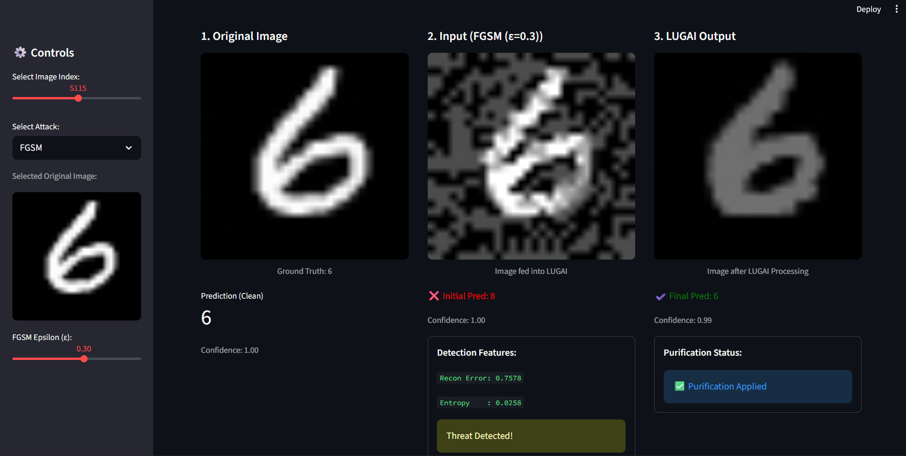

LUGAI — Latent Uncertainty Guided Adversary Intervention
=======================================================

Project Group No: 30  
Scholars:  
- **Jayal Shah** — [LinkedIn](https://www.linkedin.com/in/jayal-shah04/)  
- **Sakshi Makwana** — [LinkedIn](https://www.linkedin.com/in/sakshii125/)  
- **Mayank Jangid** — [LinkedIn](https://www.linkedin.com/in/mayank-jangid-0a5207359/)

Supervisor: **Dr. Sanjay B. Sonar**

Demo
----
Below is a screenshot of the **LUGAI Streamlit application**, which demonstrates detection and purification of adversarial inputs in real time.



Overview
--------
LUGAI is a two-stage, self-healing framework designed to defend deep neural networks against adversarial inputs. The framework detects anomalous inputs using latent uncertainty and reconstruction deviation, then restores input integrity using a denoising autoencoder prior to classification. The implementation is in Python and PyTorch, and uses Torchattacks for adversarial example generation and Streamlit for an interactive demonstration.

Status (completed so far)
-------------------------
- Project repository initialized and organized.
- Virtual environment configured and dependencies installed.
- MNIST dataset downloaded and preprocessed into Torch `.pt` tensors.
- Baseline CNN implemented and trained (saved to `models/cnn_classifier.pth`).
- Adversarial attacks implemented and evaluated: FGSM, PGD, DeepFool.
- Visualization utilities implemented to compare clean, attacked, and purified images.
- Streamlit app integrated for real-time adversarial detection and purification.

Results (example)
-----------------
Representative results on the MNIST test set:

- Clean Model Accuracy: 99.28%
- Attacked (FGSM, eps=0.3) Accuracy: 22.97%
- Purified (LUGAI) Accuracy: 93.02%
- Accuracy Recovery Rate: 91.80%

Quickstart
----------
All scripts are located in the project root directory. Run commands from the root folder.

1. Clone the repository
```bash
git clone https://github.com/014-Jayal/LUGAI-Adversarial-Defense.git
cd LUGAI-Adversarial-Defense
```

2. Create and activate a virtual environment
```bash
# Windows
python -m venv venv
.\venv\Scripts\activate

# macOS / Linux
python3 -m venv venv
source venv/bin/activate
```

3. Install dependencies
```bash
pip install -r requirements.txt
```

4. Prepare the dataset (download and preprocess MNIST)
```bash
python data_utils.py
```

5. Train models
```bash
# Train the baseline CNN classifier
python train_baseline.py

# Train the denoising autoencoder (DAE) used for purification
python train_denoising_autoencoder.py
```

6. Evaluate attacks and purification
```bash
# Evaluate baseline and attacked accuracy
python evaluate_attacks.py

# Evaluate purification (requires trained DAE)
python evaluate_purification.py
```

7. Run the interactive demo
```bash
streamlit run app.py
```
Open the URL shown by Streamlit (typically http://localhost:8501) in a browser.

Reproducing Results and Experiments
----------------------------------
Use the evaluation and visualization scripts to reproduce results:
```bash
python evaluate_attacks.py
python evaluate_detection.py
python evaluate_purification.py
python visualize_attacks.py
python visualize_purification.py
```

Repository structure
--------------------
```
LUGAI-Adversarial-Defense/
├── app.py
├── config.py
├── data_utils.py
├── model_zoo.py
├── attacks.py
├── defense.py
├── visualize.py
├── train_baseline.py
├── train_autoencoder.py
├── train_denoising_autoencoder.py
├── evaluate_attacks.py
├── evaluate_detection.py
├── evaluate_purification.py
├── visualize_attacks.py
├── visualize_purification.py
├── data/
├── models/
├── results/
│   └── figures/
├── notebooks/
├── requirements.txt
├── .gitignore
└── README.md
```

Technologies Used
-----------------
- **Programming Language:** Python 3.11  
- **Frameworks/Libraries:** PyTorch, Torchattacks, Streamlit  
- **Data:** MNIST dataset  
- **Utilities:** NumPy, Matplotlib, Seaborn, Scikit-learn, Tqdm  
- **Version Control:** Git & GitHub  

Notes and Recommendations
-------------------------
- Do not commit large datasets or model checkpoint files to the repository. Use `.gitignore` or Git LFS for large artifacts.
- For sharing pre-trained weights, provide a Google Drive or GitHub Release link.

